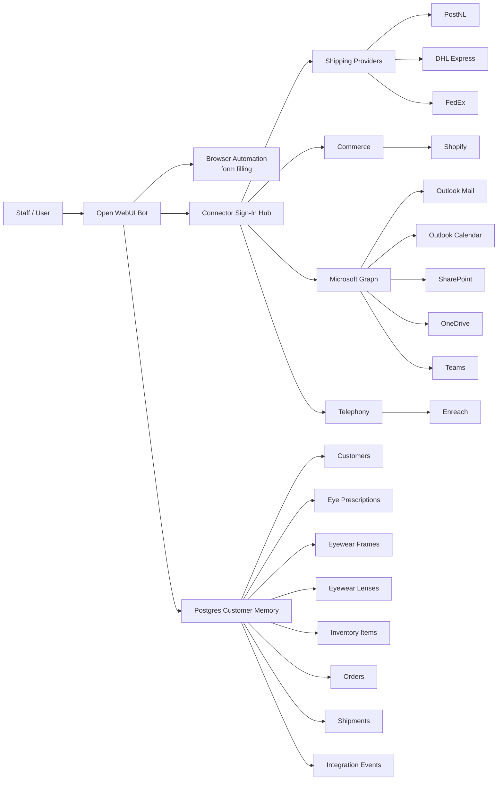
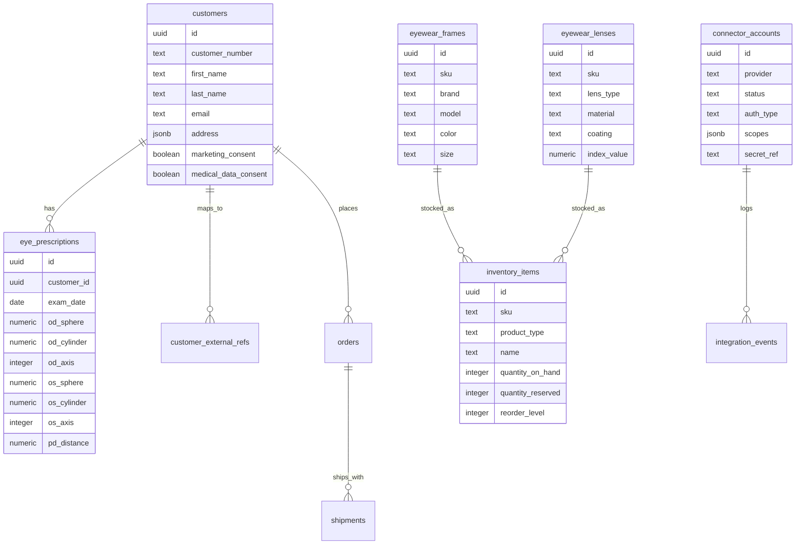

# Optical Connector Canvas

This canvas shows how the Open WebUI bot, browser automation, connectors, and Postgres customer memory are wired.

## Connector Status Model

- `needs_credentials`: the connector exists in the app, but required env vars are missing.
- `env_ready`: required env vars are present, but no connector account row has been created yet.
- `credentials_configured`: connector account row exists and required env vars were present at sign-in time.

## Database Entities

